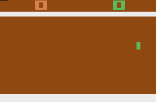
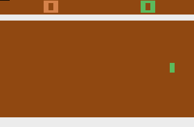
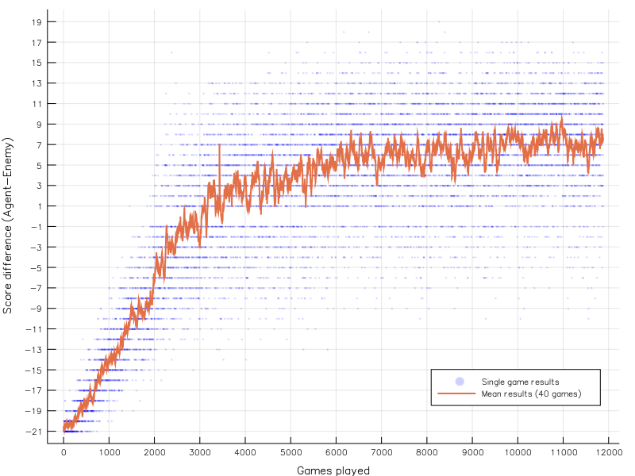

# ct_keras_pong
An AI that plays Atari 2600 Pong. Trained using reinforcement learning 
using OpenAI Gym and Keras

# Usage
## Installation
You might need to install *Swig* before being able to use the python 
libraries.

- [Windows](http://www.swig.org/Doc1.3/Windows.html)
- Arch: `sudo pacman -S swig`
- Debian/Ubuntu: `sudo apt install swig`

You need to have *OpenAI Gym* and *Keras* installed, and *wheel* is 
needed as a dependency.

`pip install wheel gym[all] Keras`

## Train the agent
Run `python train_agent.py weightfile.h5` to train an agent. If
`weightfile.h5` already exists, the training will continue from the
last point, otherwise a new training run will be started and the
progress saved to a new weights file.

A logfile with the training progress will be written to `weightfile.h5.log`.

If you do not want to show the game screen (to speed up training), set
the `render` variable in the script to `False`

### Provided Untrained Weights
The repository also provides `start_weights.h5` containing the randomly
initialized weights that were used to train the `trained_weights.h5`. 
Although I did not have any problems with the current iteration of the
training procedure, the method can be very sensitive to the initial 
weights and it might happen that your agent does not learn. For those 
cases make a copy of `start_weights.h5` to have the same starting point 
I had during training.

## Use the agent

You can run a game in real time with a weights file using `python
use_agent.py weightsfile.h5` To run the agent with the trained weights
provided run `python use_agent.py trained_weights.h5`. If
`use_agent.py` is given a second argument it will save each frame as a
`.png` file to the `media` directory using the second argument as a
prefix for the filename.

# Results to Expect
| Untrained                         | Trained                       |
|:---------------------------------:|:-----------------------------:|
|  |  |

## Learning Progress

# Acknowledgments
The code is in part based on https://github.com/mkturkcan/Keras-Pong

